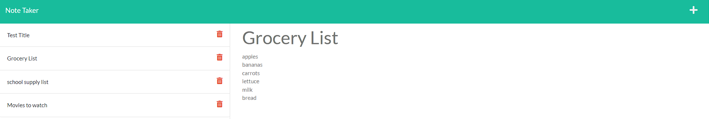

# Note Taker Starter Code

by Lisa Le

## Deployed to Heroku

[Heroku](https://mysterious-badlands-73655.herokuapp.com/)

## Description

This application is for a user to take notes on the go. The user will be able to type, save, and delete notes. Titles for each note can be added and saved to the side of the application. Saved notes can be viewed over and over when clicked on until deleted.

## Acceptance Criteria

- GIVEN a note-taking application
- WHEN I open the Note Taker
- THEN I am presented with a landing page with a link to a notes page
- WHEN I click on the link to the notes page
- THEN I am presented with a page with existing notes listed in the left-hand column, plus empty fields to enter a new note title and the note’s text in the right-hand column
- WHEN I enter a new note title and the note’s text
- THEN a Save icon appears in the navigation at the top of the page
- WHEN I click on the Save icon
- THEN the new note I have entered is saved and appears in the left-hand column with the other existing notes
- WHEN I click on an existing note in the list in the left-hand column
- THEN that note appears in the right-hand column
- WHEN I click on the Write icon in the navigation at the top of the page
- THEN I am presented with empty fields to enter a new note title and the note’s text in the right-hand column

## Techniques and Technologies used

- HTML
- CSS
- Node JS
- Express JS
- installation for Express & uuid needed

## Demo Video

## Screenshots

